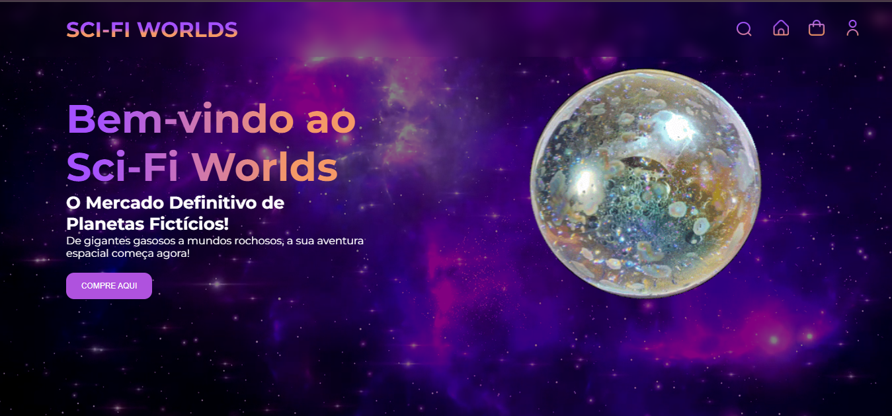
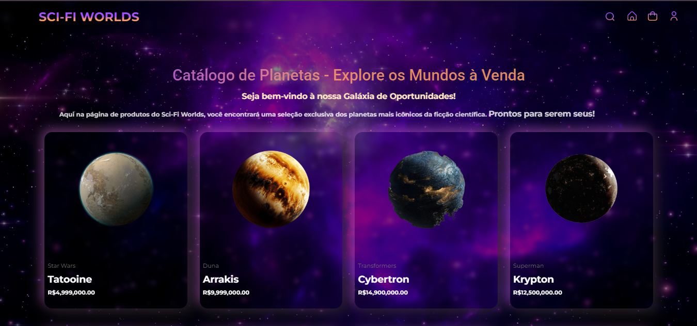
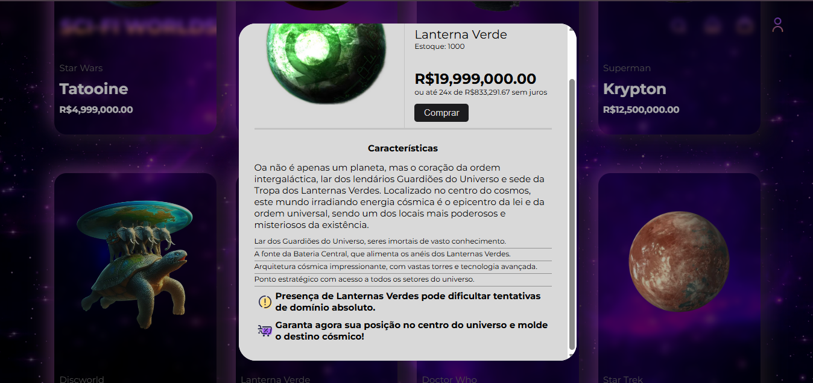

# Sci-Fi Worlds
Projeto desenvolvido para a disciplina de **Programação de Web**, com o objetivo de praticar os conhecimentos adquiridos.

## 🚀 Sobre o Projeto

Este é um site fictício de vendas que oferece planetas icônicos de filmes e séries. A ideia foi criar uma aplicação divertida, que unisse criatividade com a prática das tecnologias aprendidas em aula.

O projeto foi desenvolvido em dupla, por **Emily Chagas** e **Isabel Santos**.

Além da interface visual, o site agora conta com backend desenvolvido em Spring, permitindo a integração completa entre frontend e serviços da API.

## 🛠️ Tecnologias Utilizadas

**Frontend**
- [Angular](https://angular.io/)
- HTML5
- CSS3
- TypeScript
- Bootstrap

**Backend**
- Spring Boot
- Java
- Spring Security
- Spring Data JPA
- MySQL
- JavaMailSender

## 🎯 Funcionalidades

- 🪐 Busca de planetas fictícios
- 🔍 Visualização de detalhes de cada planeta
- 🛒 Simulação de compra
- 🔐 Cadastro e Login de cliente
- 📱 Layout responsivo

## 📷 Capturas de Tela
### 🏠 Home

### 🔐 Login

### 🖼️ Galeria

### 🔍 Detalhe do Produto

### 🛒 Cesta

## 💡 Aprendizados

Durante o desenvolvimento deste projeto, aprofundamos nossos conhecimentos em:

- Estruturação de projetos Angular e Spring
- Integração de frontend e backend via API REST
- Criação de componentes reutilizáveis e responsivos
- Comunicação entre componentes e com serviços HTTP
- Validação de formulários e autenticação de usuários
- Envio de e-mails com JavaMailSender
- Boas práticas em arquitetura de software e organização de código

## 👩‍💻 Desenvolvedoras

- [Emily Chagas](https://github.com/EmilyChagas)
- [Isabel Santos](https://github.com/Isabel2507)

## 📚 Disciplina

Projeto da disciplina **Programação de Web**, ministrada no curso de Análise e Desenvolvimento de Sistema na Fatec Ipiranga.

---
This project was generated using [Angular CLI](https://github.com/angular/angular-cli) version 19.1.7.

